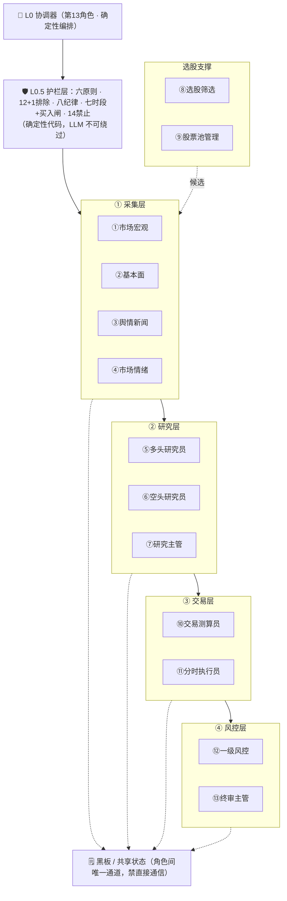
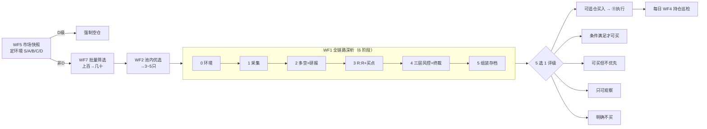

# AI 量化交易团队 · Harness

一套 **13 角色 AI 股票分析团队**的 harness（纪律编排层），在开源
[TradingAgents-CN](https://github.com/hsliuping/TradingAgents-CN) 的多 Agent 深析图之上，
加一层把交易纪律、风控、流程"焊死"进系统的确定性编排——核心目的不是预测涨跌，
而是**用固定流程约束交易行为，克服贪婪、侥幸、情绪化**。

> ⚠️ 免责声明：本项目为研究与工程示例，**不构成任何投资建议**。据此交易，风险自负。

## 设计基线（经人工逐项裁决）
- **A1 外包裹**：开源 12-Agent 深析图原样当作"单股深析"子程序复用，不改上游。
- **B1 纪律=确定性代码**：六原则 / 12+1 排除 / 八纪律 / 时段闸 / 14 禁止行为全部硬编码，LLM 不可绕过、可审计、零幻觉。
- **C1 协调器=第 13 角色**：统一调度，Agent 间不直接通信（黑板模式）。

## 架构总览

**分层架构（13 角色 + 护栏 + 黑板）**



**漏斗流程（7 工作流组合 → 个股 6 阶段 → 5 选 1 评级）**



## 快速开始
```bash
pip install -r requirements.txt          # 仅需 PyYAML（确定性核心）
python -m harness.demo                    # 离线演示：6 阶段 + 漏斗 + 5 选 1 评级
python -m harness.tests.test_guardrails   # 护栏单测（应 22/22 通过）
```
接真实深析引擎：clone 上游 TradingAgents-CN、装其依赖、配 `.env` 与模型 key，
再把 `StubDeepDiveAdapter` 换为 `DeepDiveAdapter`。

---

# 详细设计文档（01–09）

完整文档在 [`harness/docs/`](harness/docs/)，以下为各篇要点。

## [01 · 团队分工（13 角色）](harness/docs/01-team-roles.md)
13 角色按"采集 → 研究 → 交易 → 风控"四层递进，由协调器统一调度。**Agent 间不直接通信**——
每个角色只读上游写好的"黑板"字段、只写自己的字段（对应禁止行为 P-06）。实现方式分
**LLM / 确定性 / 混合**三种：分析师与研究员是 LLM，选股筛选/池管理/执行员/一级风控是确定性代码，
宏观分析师与测算员是混合。

| # | 角色 | 层 | 实现 |
|---|---|---|---|
| ① | 市场宏观分析师 | 采集 | 混合（LLM 评分 → 确定性定级） |
| ② | 基本面分析师 | 采集 | LLM（复用开源） |
| ③ | 舆情新闻分析师 | 采集 | LLM |
| ④ | 市场情绪分析师 | 采集 | LLM |
| ⑤ | 多头研究员 | 研究 | LLM |
| ⑥ | 空头研究员 | 研究 | LLM |
| ⑦ | 研究主管 | 研究 | LLM |
| ⑧ | 选股筛选 | 选股 | 确定性 |
| ⑨ | 股票池管理 | 选股 | 确定性 |
| ⑩ | 交易测算员 | 交易 | 混合 |
| ⑪ | 分时交易执行员 | 交易 | 确定性 |
| ⑫ | 一级风控 | 风控 | 确定性 |
| ⑬ | 终审风控主管 | 风控 | LLM + 确定性否决闸 |
| — | 协调器（第 13 角色之上的编排器） | L0 | 确定性 |

## [02 · 六大核心原则](harness/docs/02-six-principles.md)
六原则被编码为**可执行约束**而非口号：

| 原则 | 落地方式 |
|---|---|
| 环境优先 | 流水线第一步必为环境定级；D 级直接空仓 |
| 先排除后推荐 | 先用排除规则砍，幸存者才进深析与推荐 |
| 禁止模糊语言 | 结论必须是明确枚举；含"可能/也许/都行"等词直接抛错 |
| 必须有取舍 | 候选超容量强制砍；出手需置信度+盈亏比双门槛，否则空仓 |
| 承认信息缺口 | 缺字段显式标注、下调置信度；关键字段缺失禁买 |
| 严格止盈止损 | 买入必带止盈止损，裸单拒绝；点位来自规则不可篡改 |

## [03 · 市场环境五级定级](harness/docs/03-market-regime-grading.md)
两条独立的轴：**评分**（6 因子加权 0–100，决定落在哪一级）与**仓位**（每级对应固定总仓位区间）。

| 级 | 总仓位 | 单票上限 | 开新仓 | 含义 |
|---|---|---|---|---|
| S | 80–100% | 40% | 3 | 偏好·政策/资金/情绪共振 |
| A | 50–60% | 30% | 2 | 利好·结构性机会 |
| B | 20–30% | 20% | 1 | 中性偏暖·轻仓短线 |
| C | 10–20% | 10% | 0 | 中性偏凉·仅管存量 |
| D | 0–5% | 0% | 0 | 强利空·强制空仓 |

6 因子：指数趋势(0.30)、市场宽度(0.25)、量能(0.15)、稳定度(0.10)、资金流(0.12)、情绪(0.08)，
统一"越高越偏多"。**共振加成**：三因子≥70 则综合分 +5（更易上探 S 级）。**政策利空一票压 D**：
系统性风险无视分数直接判 D。

## [04 · 12+1 项检查/排除规则](harness/docs/04-exclusion-rules.md)
分三类，喂给个股 5 选 1 评级：
- **红线（单条即剔）**：E-04 重大利空（立案 / ST / 巨额解禁>5% / 第一大股东质押>70% / 重大安全事故）。
- **硬排除（计数，≥2 → 只可观察）**：E-01 基本面恶化（净利连降或毛利<20%）、E-02 估值过高（PE>行业均值×2 且无增长）、E-03 技术破位（破 MA60 且 MACD 死叉）、E-05 流动性不足（日均额<5000万 或 换手<0.3%）、E-13 负面舆情>80。
- **情境闸（不剔除标的，只压评级）**：E-06 违背大盘方向、E-07 风报比<2:1、E-08 时机不当（14:30后/尾盘/追涨）、E-09 资金管理（持仓>3 / 单票超上限）、E-10 除权除息（抢权涨幅>5% 或 除权后 3 日冷却）、E-11 系统风险（D禁/C减）、E-12 同板块>2。

数据缺失：安全红线缺失保守剔除，其余记信息缺口、不武断剔除。

## [05 · 七套战术工作流](harness/docs/05-workflows.md)
标准化工具库，可自由组合成漏斗：
```
WF5 市场快照(定环境) ─非D→ WF7 批量筛选(上百→几十) → WF2 池内优选(→3-5只)
   → WF1 全链路深析(逐只深挖) → 落地 → 每日 WF4 巡检；突发 → WF6 批注
```
| WF | 名称 | 成本 | 用途 |
|---|---|---|---|
| 1 | 全链路深析 | 重 | 重点标的 6 阶段深挖 |
| 2 | 池内优选 | 轻 | 池内排除+排序 |
| 3 | 横向对比 | 中 | 3-5 只同业并排 |
| 4 | 持仓巡检 | 轻 | 每日收盘止损/止盈 |
| 5 | 市场快照 | 轻 | 一键环境定级 |
| 6 | 补充批注 | 轻 | 突发事件→重评 |
| 7 | 批量筛选 | 极轻 | 整池粗筛 |

## [06 · 个股全链路 6 阶段](harness/docs/06-analysis-pipeline.md)
| 阶段 | 内容 | 角色 |
|---|---|---|
| 0 | 环境分析 → S/A/B/C/D | ① |
| 1 | 四大分析师并行采集 | ②③④+技术 |
| 2 | 多空辩论 + 主管裁决 + 研报 | ⑤⑥⑦ |
| 3 | 交易员 R:R + 买点精算 | ⑩ |
| 4 | 三层风控（排除精排 / 纪律 / 环境）+ 主管终裁 | ⑧⑫⑬ |
| 5 | 报告组装 + 存档（含数据溯源） | 协调器 |

**排除规则跑两次**：粗排（深析前、省 LLM）+ 精排（阶段4、用深析新挖事实判定定性项）。
**最终 5 选 1 评级**：可适仓买入 / 条件满足才可买 / 可买但不优先 / 只可观察不可买 / 明确不买。

## [07 · 八项铁律交易纪律](harness/docs/07-trading-discipline.md)
| 纪律 | 量化 |
|---|---|
| D-01 三档止损 | 日 -3~-5% 整体减半；周 -5~-8% 降至≤30%；月 -8~-12% 清仓+暂停5日 |
| D-02 持仓数 | 最多 3 只 |
| D-03 单票上限 | min(环境档, 30%) |
| D-04 浮亏不加仓 | 日内浮亏禁补仓 |
| D-05 止盈分档 | +10% 减半，剩余移动止盈（回撤≥6% 了结） |
| D-06 不追暴涨 | 3日≥+20% / 单日≥+9% / ≥2连板 → 禁开新仓 |
| D-07 不频繁反复 | 卖出冷却≥3日、20日往返≤2次 |
| D-08 单日次数 | 开仓≤3笔、总交易≤5笔（硬止损不受限） |

## [08 · 分时时段 + 买入条件闸](harness/docs/08-time-rules-and-buy-gate.md)
七大时段：集合竞价/开盘确认（只观察）→ 早盘主力窗口（谨慎不买）→ 10:00-11:30 次优买入 →
午间（不交易）→ 13:00-14:30 最后买入 → 14:30 后尾盘（只卖不买）。

**买入条件复合闸**（全满足才开新仓）：
`环境≥B ∧ 硬排除≤1 ∧ 风报比≥2:1 ∧ 时间<14:30且在买入窗口 ∧ 持仓<3`。

## [09 · 14 条永久禁止行为](harness/docs/09-prohibitions.md)
聚焦 **AI 行为红线**（结论质量/流程完整/数据质量/通信）；交易侧约束由纪律 D-01~D-08 强制，不重复。
**任一触发 → 本次分析作废重算**，重算耗尽则升级人工裁决，绝不静默放行。

P-01 禁止二选一结论 ｜ P-02 禁止跳过低级风控 ｜ P-03 禁止主观臆测填充 ｜ P-04 未完成禁止跳过 ｜
P-05 禁止尾盘换票 ｜ P-06 禁止跨 Agent 通信 ｜ P-07 禁止省略环境注入 ｜ P-08 禁止仅抛原始数据 ｜
P-09 禁止单向论证 ｜ P-10 禁止"两个都行" ｜ P-11 禁止忽略仓位上限 ｜ P-12 禁止止损延期 ｜
P-13 禁止未校准数据源 ｜ P-14 禁止修改风控参数。

---

## 代码目录
```
harness/
├── docs/            01-09 详细设计文档
├── config/          全部纪律阈值（唯一真相来源）+ 股票池
├── guardrails/      护栏层：排除/纪律/时段/原则/禁止行为/引擎
├── regime/          市场环境定级
├── pool/            两层股票池
├── agents/          宏观分析师 / 测算 / 三层风控终裁
├── orchestrator.py  协调器（6 阶段 + 漏斗）
├── deep_dive.py     深析适配器（真/桩）
├── execution.py     分时执行员
├── ledger.py        交易流水（频率/次数）
├── workflows.py     7 套战术工作流
├── demo.py / tests/
```

## 许可
本仓库代码以 MIT 许可发布（见 [LICENSE](LICENSE)）。上游 TradingAgents-CN 为独立第三方项目，
本仓库不包含其代码，使用者需自行获取并遵守其许可。
